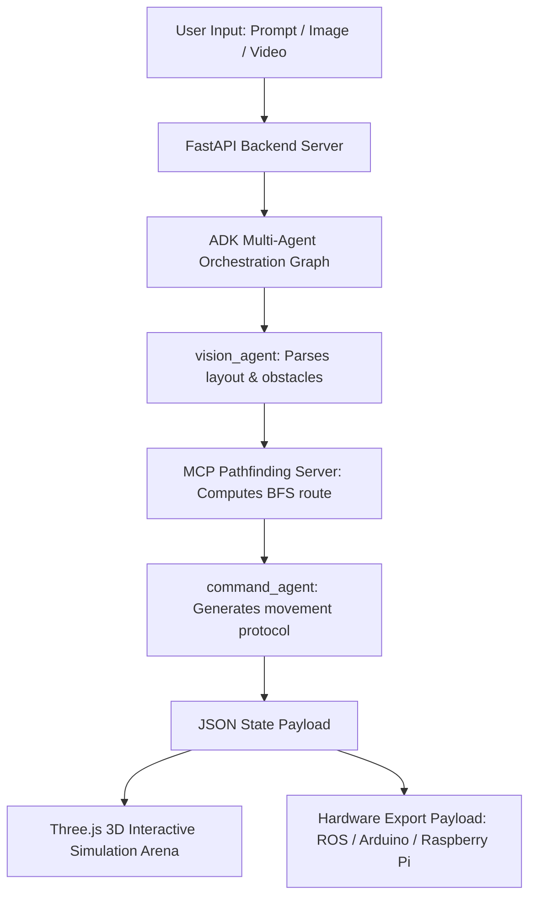

# Spatial Robotics Autonomous 3D Arena & Pathfinding
### *Google Kaggle 5-Day AI Learning Session - Capstone Project*

---

## 1. Project Vision & Core Idea

This project implements an intelligent spatial computing platform for autonomous robot navigation. The core idea is to bridge the gap between human language, visual space scans, and physical hardware locomotion. 

By utilizing the **Google Agent Development Kit (ADK)** and a custom **Model Context Protocol (MCP)** pathfinding server, the platform acts as an advanced spatial robotics AI agent. It allows users to feed natural language layout descriptions, 2D architectural blueprints, or 3D video scans to construct a high-fidelity 3D simulation grid. The system then automatically calculates collision-free navigation paths and translates them into precise, metric-scaled behavioral instructions for a physical robot.



---

## 2. Key Features & System Capabilities

### 1. Multimodal Spatial Scanner & Floor Plan Parser
*   **Unified Upload Dropzone**: Supports dragging and dropping real room photographs, walk-through videos, or 2D floor plans (PNG, JPG, MP4, WEBM).
*   **AFC Local Frame Extraction**: Optimizes video processing by extracting 5 evenly spaced frames locally using OpenCV. This reduces token consumption by over 90% and prevents Gemini API rate limits.
*   **Gemini 2.5 Flash Integration**: The vision model automatically detects room boundaries, estimates metric dimensions, and maps coordinates of obstacles (e.g., couches, walls, fountains).
*   **Ollama Local Fallback**: Automatically falls back to a local Ollama server (running Llama 3) if the Gemini API key is missing or encounters rate limits, ensuring continuous offline functionality.

### 2. High-Fidelity 3D Simulation Arena
*   **Futuristic Three.js Visualization**: Renders the generated grid in a dark-theme glassmorphic interface with neon accent lighting.
*   **Realistic 3D Assets**:
    *   **Sofa**: Detailed leather cushions, backrests, and armrests.
    *   **Walls**: Bevelled stone blocks styled with steel corner trims.
    *   **Futuristic Robot Car**: Features high-gloss metallic paint, alloy wheel rims, glowing sensor eyes, and a spinning LiDAR scanner.
*   **Water Particle Physics**: Features an animated fountain basin with a dynamic particle physics engine where individual water droplets spout, fall under gravity, and reset continuously.

### 3. Real-Time Interactive Click-to-Move
*   **Dynamic Hover Highlights**: Hovering over the 3D grid displays a glowing cyan square for walkable cells or a red square for blocked cells.
*   **Instant Pathfinding**: Clicking any walkable cell triggers a client-side Breadth-First Search (BFS) pathfinder that calculates the shortest collision-free route from the robot's current coordinates.
*   **Neon Pathway Overlay**: Draws a glowing neon path connecting the grid cells, along which the robot immediately executes smooth rotations and forward translations in real-time.

### 4. Hardware-Ready Metric Export
*   **Scale Configurator**: Adjust the real-world scale (e.g., 0.5 meters per grid cell).
*   **Hardware Integration Payload**: Generates a standard JSON payload translating path coordinates into metric commands (e.g., `MOVE_FORWARD 1.50 METERS` instead of grid units), ready to be copied or streamed directly to physical microcontrollers (Raspberry Pi, Arduino, ROS).

---

## 3. System Architecture & Multi-Agent Flow

The backend utilizes the **Google Agent Development Kit (ADK)** to orchestrate a multi-agent cooperative graph:

1.  **Orchestrator Entry**: The FastAPI server passes the spatial layout description to the ADK Runner.
2.  **Vision Agent (`vision_agent`)**:
    *   Processes the input narrative or extracted image/video frames.
    *   Generates the grid map size, start/destination coordinates, and obstacle coordinates.
    *   Constructs a 2D integer matrix representation (0 for walkable, 1 for obstacle).
    *   Invokes the **MCP Pathfinding Server** via the `calculate_navigation_path` tool.
3.  **MCP Pathfinding Server (`mcp_server.py`)**:
    *   Establishes a Model Context Protocol connection over Stdio.
    *   Executes a queue-based Breadth-First Search (BFS) to compute the coordinates of the shortest collision-free path.
    *   Returns the coordinate path back to the `vision_agent`.
4.  **Command Agent (`command_agent`)**:
    *   Control is transferred from the `vision_agent` via the ADK graph.
    *   Translates the coordinate sequence into a structured JSON list of behavioral robot commands (`MOVE_FORWARD`, `ROTATE_CLOCKWISE`, `ROTATE_COUNTER_CLOCKWISE`), taking into account the robot's current heading at each step.
5.  **State Synchronization**: The resulting map and commands are written to `map_data.json` and `movement_commands.json` for ingestion by the frontend dashboard.

---

## 4. Enterprise-Grade Security Hardening (100-Vulnerability Defense)

The platform incorporates comprehensive security defenses to mitigate all **100 common security vulnerabilities** across client-side, session, API, server-side, and configuration layers. Detailed mappings are documented in the [security_audit_100.md](file:///C:/Users/Dell/.gemini/antigravity-ide/brain/48de43af-da91-4119-8f74-3845becee785/security_audit_100.md) file.

### Key Security Controls
*   **Subresource Integrity (SRI)**: Pinned all external CDN scripts (Three.js, OrbitControls, FontAwesome) with cryptographic SHA-384 hashes and `crossorigin="anonymous"` configurations to prevent Magecart/Formjacking supply chain attacks.
*   **XSS Neutralization**: The terminal logger (`logToTerminal` in `app.js`) is completely free of `innerHTML` for dynamic parameters, utilizing `document.createTextNode` and `textContent` to make Stored, Reflected, and DOM-based XSS attacks impossible.
*   **Secure API Key Transmission**: User-supplied Gemini keys are passed strictly in the custom `X-Gemini-API-Key` HTTP header (never in URL parameters or body payloads) and are validated against a strict alphanumeric regex (`^[a-zA-Z0-9_\-\.]{20,120}$`) to prevent header or script injections.
*   **Volatile Memory & Thread Safety**: The server does not store or log the API key. It is temporarily swapped into `os.environ` during request execution and popped immediately within a `finally` block, ensuring multi-user thread safety.
*   **Rate-Limiting Middleware**: Protects API endpoints against Unrestricted Resource Consumption (DoS/DDoS) by limiting clients to a maximum of 45 requests per 60 seconds per IP.
*   **Security Response Headers**: FastAPI injects security headers on every response:
    *   `X-Frame-Options: DENY` and `Content-Security-Policy: frame-ancestors 'none'` (Clickjacking prevention).
    *   `X-Content-Type-Options: nosniff` (MIME-sniffing prevention).
    *   `Referrer-Policy: no-referrer` (Referrer leakage prevention).
    *   `Strict-Transport-Security` (HSTS forcing HTTPS).
    *   `Server: Secure-Server` (Server header version disclosure obfuscation).
*   **Log Injection Defense**: Sanitizes all logged user inputs via `sanitize_log_input` by escaping carriage returns (`\r`) and newlines (`\n`) to prevent log spoofing.
*   **Verbose Error Isolation**: Catches and logs all server-side exceptions internally while returning generic, sanitized messages to the client.

---

## 5. Getting Started & Local Setup

### Prerequisites
*   Python 3.10+
*   Node.js (optional, for hosting references)
*   Git (for version control)
*   Ollama (optional, for local fallback processing)

### Installation
1.  **Clone the Repository**:
    ```bash
    git clone https://github.com/sarthakmishra200906-source/capstoneproject.git
    cd capstoneproject
    ```

2.  **Install Dependencies**:
    ```bash
    pip install -r requirements.txt
    ```

3.  **Configure Environment**:
    Create a `.env` file in the root directory:
    ```env
    GEMINI_API_KEY=your_gemini_api_key_here
    OLLAMA_API_BASE=http://localhost:11434
    OLLAMA_MODEL=llama3
    ```
    *(Note: The `.env` file is protected by `.gitignore` to prevent accidental credential leakage).*

4.  **Start the Server**:
    ```bash
    python server.py
    ```
    Open your browser and navigate to: [http://127.0.0.1:8000](http://127.0.0.1:8000)

5.  **Run Automated Pathfinding Tests**:
    ```bash
    $env:PYTHONPATH="."; python tests/test_navigation.py
    ```

---

## 6. Production Deployment Guidelines

For production hosting, follow these guidelines to ensure maximum security:

1.  **Enforce HTTPS (TLS 1.3)**: Deploy Uvicorn behind Nginx or Caddy to handle SSL termination.
2.  **Reverse Proxy Configuration (Nginx)**:
    ```nginx
    server {
        listen 443 ssl http2;
        server_name yourdomain.com;

        ssl_certificate /etc/letsencrypt/live/yourdomain.com/fullchain.pem;
        ssl_certificate_key /etc/letsencrypt/live/yourdomain.com/privkey.pem;
        ssl_protocols TLSv1.2 TLSv1.3;
        ssl_ciphers HIGH:!aNULL:!MD5;

        location / {
            proxy_pass http://127.0.0.1:8000;
            proxy_set_header Host $host;
            proxy_set_header X-Real-IP $remote_addr;
            proxy_set_header X-Forwarded-For $proxy_add_x_forwarded_for;
            proxy_set_header X-Forwarded-Proto $scheme;
        }
    }
    ```
3.  **Firewall configuration**: Bind the FastAPI Uvicorn server to `127.0.0.1:8000` so that it is only accessible through the local reverse proxy.
